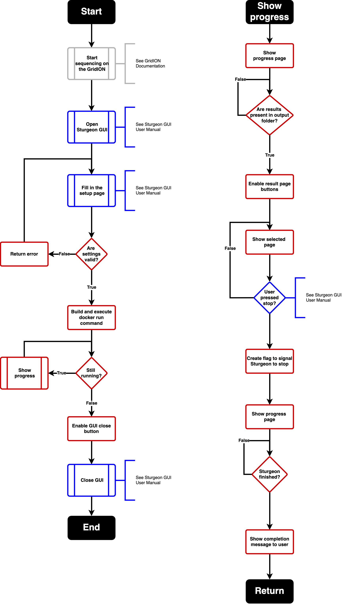

# Sturgeon GUI

Graphical User Interface for the [Sturgeon application](https://github.com/princessmaximacenter/sturgeon)
The main function is to create and run a Docker command to start Sturgeon, have a graphic display on the current process, 
showing the latest plots/table, as well as signaling Sturgeon to stop.

### System requirements
**Hardware:**
- NVIDIA CUDA graphics card
- GridION (not a hard requirement but used during development/testing)

**Software:**
- Docker
- [NVIDIA Container Toolkit](https://docs.nvidia.com/datacenter/cloud-native/container-toolkit/latest/install-guide.html)
  - Make sure to validate the installation `sudo docker run --rm --gpus all nvidia/cuda:11.0.3-base-ubuntu20.04 nvidia-smi`
- Java 11
- Bash
- Linux OS

### Configuration
The configurations can be found in the following file: `src/main/resources/Config.yml`
This contains the following settings:
- **cnvPlot**: Default name format of the CNV plots. The code does expect iteration_0 to be present in the name.
- **confidencePlot**: Default name format of the confidence plots. The code does expect iteration_0 to be present in 
the name.
- **confidenceTable**: Default name format of the confidence table. The code does expect iteration_0 to be present in 
the name.
- **predictPlot**: Default name format of the prediction plots. The code does expect iteration_0 to be present in the 
name. 
- **version**: Version of the GUI.
- **devMail**: Mail address of the developer/maintainer of the GUI. Is shown when starting the tool so the operator has 
a contact point for questions/issues.
- **refGenome**: Path (host) to directory where the reference genome files are present. 
- **model**: Path (host) to the model zip file used by Sturgeon to make predictions.
- **sturgeonImage**: Name of the Sturgeon image.
- **wrapperScript**: Path (container) where to find the R wrapper script to run. 
Currently only supports live_processing_fast5s_guppy_v6.5.R
- **extraArgs**: Extra arguments given to the Docker run call. 
- **wrapperFlagDir**: Path (host) to the directory to write the wrapper flags to. These flags are used by Sturgeon to 
check if it is already running or if it needs to stop. 
- **defaultDir**: Default directory to open the file explorer add when choosing the input pod5 folder.
- **logDir**: Directory (host) to write the log files to.

### How to install
Requirements:
- Java 11
- Maven
- Sturgeon (if you use this outside the production environment 
you might want to doublecheck src/main/resources/Config.yml if everything is aligning with your situation)

Build jar file:
```
# cd to sturgeon-gui folder and run the following:
mvn clean compile install
# Jar file can be found in the target folder and you can run it by:
java -jar target/sturgeon-gui.jar
```

### Hints and known bugs:
- Due to hardware limitations of the GridION OS, only one sample can run at the time. This GUI has been made with this in mind.
- The layout of the GUI is not always stable. Usually resizing or restarting the GUI helps.
- The GUI and the docker back-end are not directly linked. Meaning if the GUI crashes or is forced quit, the container will keep running. Manually stop the container if needed.
- It is currently not possible to restart the GUI once a run is finished. For now just close the GUI and start it again.
- Check the log in the logDir (see config) for hints if errors have occurred.

### Workflow
Color meaning:
- Grey = Lab process defined outside this repository.
- Blue = User interacting with the GUI as defined in the [UserManual](doc/UserManual.pdf).
- Red = GUI processes.



### Contact
Maintained by the Translation Bioinformatics group
Developer: Alex Janse