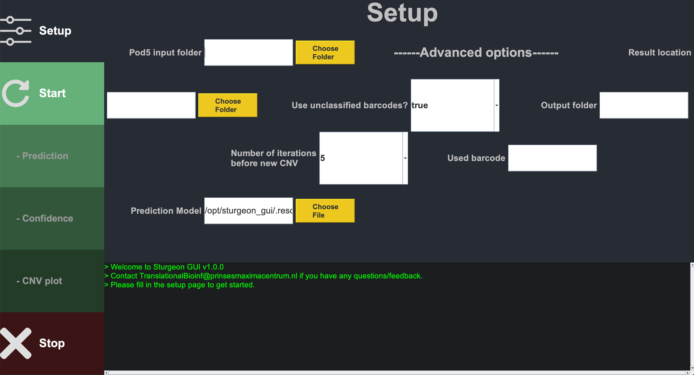

# User Manual Sturgeon GUI

### Content

1. [Description](#description)
2. [How to install?](#how-to-install)
3. [How to use?](#how-to-use)
4. [FAQ](#faq)

### Description
This document contains information on how to install and use the Sturgeon GUI tool. To help the readability of this 
document, colors are used to highlight 
<b>buttons</b>,
<b>labels</b> and
<b>panels</b>.

## How to install?
1. Login using your credentials in Gridion
2. Open the folder explorer, click on <b>other locations</b> and 
select <b>this computer</b>
3. Go to <b>opt</b> and then 
<b>sturgeon_gui</b>
4. Right mouse click on <b>sturgeon.sh</b>  and select 
<b>copy to...</b>
5. Select your <b>Desktop</b>  folder and click 
<b>select</b>  in the top right corner.
6. A copy of the file should now appear on your desktop which you can double-click to start the application.

## How to use?

### 1. Start the application
On the desktop an icon should be present named sturgeon.sh (if not following the [install guide](#how-to-install)), double click 
this to start the GUI. The screen contains three panels:  
* <b>Menu</b>: The vertical bar on the left side of the screen 
contains the buttons used to start, stop and switch between the pages when Sturgeon is running.
  * <b>Setup</b>: This is the homepage of the tool where you can 
fill in the settings of the run.
  * <b>Start</b>: Use this button after the setup to start the run.
 This button will change to <b>Progress</b> when Sturgeon has 
started. Here you can then find the current status of the run.
  * <b>Prediction</b>: Contains the plot with the confidence score 
of all possible outcomes of an iteration.
  * <b>Confidence</b>: Contains a confidence table and 
confidence-over-time plot. Table consist of labels, total score and score of the iteration (by default sorted on 
highest total score). The plot contains all scores and how they change over time. Also contains threshold lines.
  * <b>CNV plot</b>: Contains the copy number variant/alteration 
plot.
  * <b>Stop</b>: Button to send a signal to Sturgeon to stop when 
it is done with the current iteration. 
* <b>Log</b>: The horizontal bar at the bottom contains the log 
of the tool. Here you can find instructions, progression and warning/errors that appear while running the tool.
* <b>Display</b>: The screen on top of the 
<b>Log</b>. Here you can find the page of the currently 
selected page as selected in the <b>Menu</b>.

### 2. Setup

Every time you want to start a run you have to fill in the following:
* <b>Pod5 input folder</b>:  folder location where the Gridion 
writes the pod5 files to. You can use the <b>Choose Folder</b> 
button to navigate to this folder.
* <b>Result location</b>:  Select a location where to make a new 
output folder. You can use the <b>Choose Folder</b>  button to 
navigate to this location.
* <b>Output folder</b>:  Name of the output folder that needs to be 
made. Note that this folder cannot exist yet in the location given in the 
<b>Result location</b>.
* <b>Used barcode</b>:  Barcode used while running Gridion. If your 
barcode is for example 09 it is fine to just fill in 9 as the 0 is added in the background if missing.

The following settings have sensible default values. Only change if required:
* <b>Use unclassified barcodes?</b>:  Allow the predictor to also 
look at reads that have another barcode than the given barcode.
* <b>Number of iterations before new CNV</b>:  How frequent do you 
want sturgeon to make a new CNV plot?
* <b>Prediction Model</b>:  Location of the model used by the 
classifier. If this value is to be changed for diagnostics runs please contact the Translation Bioinformatics team 
first!

If everything is filled in you can press Start. If the 
<b>Display</b> doesn't change please check the 
<b>Log</b> panel if there is an error regarding the input 
values and change accordingly. 

### 3. Progress

If the input values of the setup are approved, the 
<b>Display</b> will show the 
<b>Progress</b> page which shows at which step it is at and which 
iteration is running. 

When plots are generated, the corresponding buttons will be activated in the 
<b>Menu</b> which you can click on to see the corresponding 
plots/tables.
While looking at a plot, it **will not** automatically update the 
<b>Display</b> if a new plot is created. 
Simply click on <b>Progress</b> or another plot tab, and go back in 
order to see the latest plot. 
If you wish to see previous plots, go to <b>Progress</b> and click 
on the <b>Result folder</b> button. 
This opens a file explorer to the output folder where you can find folders per iteration which contains the plot files.

### 4. Stop

When you are ready to finish the run, do the following:
1. Stop the GridION sequence run (not required persé but good practice)
2. Click on the <b>Stop</b> button and confirm you want to stop. 
(The <b>Display</b> should show to the 
<b>Progress</b> page and the title is changed to mention that it 
will finish the current iteration)
3. Once the <b>Log</b> panel say it is safe to close, click the 
shutdown (<b>x</b>) button.

**It is in the current version not possible to restart the program for a new run. So for now please shut down the 
program and repeat the steps in this document.**
 
 

### FAQ
**q. It won't allow me to shut down the application.**   

**a.**  When pressing <b>Start</b>, the application is locked until 
the classifier has stopped. We do this to prevent the classifier to be running in the background while the front-end is 
closed, leading to potential issues when another run is started. To stop the application, please press 
<b>Stop</b> and wait till the last iteration has finished and the 
<b>Log</b> panel tells you it is safe to close it. If for some 
reason it is not stopping, contact the Translational Bioinformatics Team ([TranslationalBioinf@prinsesmaximacentrum.nl](mailto:TranslationalBioinf@prinsesmaximacentrum.nl)).

**q. The application looks all messed up on start up.**  

**a.**  It can happen that the <b>Setup</b> page looks weird with 
labels and fields not being in the right place. This is a random bug that sometime appears. In such case you can just 
shut down and restart the program. Otherwise, try to resize the screen. If it is still messed up please contact the 
Translation Bioinformatics Team ([TranslationalBioinf@prinsesmaximacentrum.nl](mailto:TranslationalBioinf@prinsesmaximacentrum.nl))

**q. I have a question / feedback / error / problem related to this program.**   
**a.**  Please contact the Translational Bioinformatics Team ([TranslationalBioinf@prinsesmaximacentrum.nl](mailto:TranslationalBioinf@prinsesmaximacentrum.nl)).